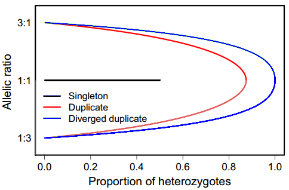

### -------------------------------------------------------------------------------
# Tutorial in pregress...
### -------------------------------------------------------------------------------
# Day4 : Copy Number Variants

## overview
During this practical, you will search for putative copy number variants within a VCF file. Then. putative CNVs identified will be examine for environmental association with temperature. For this practical, we will use a lax filtered vcf file based on the 14 Canadian Capelin sampling sites.

### Step 1: copy basic files
First we need to copy two initial files within our working folder using the following command lines:
```
#copy population map info
cp ../../00_documents/info_samples.csv 01-info_files/
#copy raw vcf file
cp ../../01_day1/stacks/populations_canada_random/populations.snps.vcf 02-data/capelin_canada.vcf
```
### Step 2: VCF filtering
Before analysis of CNVs pattern, we will filter the raw vcf file in order to remove poor represented SNPs, which can introduce some bias in our analysis.
To do so, we will use a custom python script and set the following options:
* minimum allele coverage to keep genotype = **4**
* minimum percent of genotype data per population = **60**
* maximum number of populations that can fail percent_genotypes = **0**
* minimum number of samples with rare allele = **6**

```
python 00-scripts/01-filter_vcf_fast.py 02-data/capelin_canada.vcf 4 60 0 6 02-data/capelin_canada_filtered_4_60_0_6.vcf
```
### Step 3: Explore SNP duplication
<span style="color:red">**History for CNVs detection....in progress...** </span>



First of all, we will use the following python script to extract some statistics from the filtered vcf files
* MedRatio
* PropHet
* PropHomRare
* Fis

```
python 00-scripts/02_exrtact_snp_duplication_info.py 02-data/capelin_canada_filtered_4_60_0_6.vcf \
03-analyses/01-snp_duplication/capelin_canada_filtered_4_60_0_6_overmerged_loci.txt
```
Then, we will make some descriptives plots using R in order to explore the expective pattern of various SNP categories. To do that, we have a basic Rscript that we can run with default options for initial observations.
```
Rscript 00-scripts/03.0_snp_categorization.R 03-analyses/01-snp_duplication/capelin_canada_filtered_4_60_0_6_overmerged_loci.txt
```
Here, we can see that the default options are not quite fitting the expected patterns. In fact, each dataset is different, and defining SNPs categies require some adjustments to fit with the expected pattern. So, we need to modify some options within the Rscript 03.0_snp_categorization.R.
To work with our own settings, we will copy the initial Rscript and then open it with Rstudio for modifications.
```
cp 00-scripts/03.0_snp_categorization.R 00-scripts/03.1_snp_categorization_modif.R
```
<span style="color:red">**Let see which modification we can add to better define our SNP categories...
first, ... to be continue...** </span>

### Step 4: Split the vcf file to sub-vcf of SNP categories
Once each SNPs have been attributed to a given category, we have to split the whole vcf file into sub-vcf constituted by each set of SNPs categorized.
To do this, we have a custum python script
```
python 04_split_vcf_in_categories.py 02-data/capelin_canada_filtered_4_60_0_6.vcf 03-analyses/01-snp_duplication/capelin_canada_filtered_4_60_0_6_overmerged_loci.txt.categorized
```
here, we splitted the whole filtered vcf file into five sub-vcf.
You can see this by listing the cmd line : ``ls 02-data/*.vcf``

### Step 5: Extract read count information for CNVs data
To examine the CNVs data, we will use the read count information as a proxy to inform us about putative variability among samples/populations.

To do so, we will extract the read depth information from the vcf file containing duplicated SNPs using the software **vcftools**.
```
vcftools --vcf 02-data/capelin_canada_filtered_4_60_0_6.duplicated.vcf --geno-depth --out 02-data/capelin_canada_filtered_4_60_0_6.duplicated
```
For further analyses, we also need the RADtag id of each duplicated SNPs. To get this information, use the following command line :
```
grep -v "#" 02-data/capelin_canada_filtered_4_60_0_6.duplicated.vcf | cut -f -3 | perl -pe 's/:/\t/g' | cut -f -4 > CNVS_RADtag_ids.txt
```
This will give you a file composed by four columns such as :
* Chr No
* Chr position
* RadTag id
* SNP position within the RadTag

### Step 6: CNVs read count normalization
<span style="color:red">**history...why normalization...?...to be continue...** </span>

For this step, let's go to Rstudio.
In the initial step, load the R libriries that we will need.
```
library(dplyr)
library(magrittr)
library(tibble)
library(edgeR)
```
Then load the require data files.
```
# |---------|
# | Step 1  | ================> load data files
# |---------|

#1.load population map
popmap <- read.table("01-info_files/info_samples.csv", h=T, sep=';') %>%
              select(., -file) #remove column file which unecessary here

#2. load the CNVs_radTag information
CNVs_radTag <- read.table("CNVs_RADtag_IDs.txt") %>%
      set_colnames(., c("CHROM", "POS", "RadTag", "TagPOS")) %>%
      mutate(., RadTag_all=paste(CHROM,POS,RadTag,sep='_'))

#3. load gdepth file of duplicated SNPs (output from vcftools --geno-depth)
gdepth_raw_data <- read.table("02-data/capelin_canada_filtered_4_60_0_6.gdepth", h=T) %>%
                        mutate(.,  RadTag_all =  RadTag_all) %>%
                        select(., CHROM, POS, RadTag_all, everything())

#check the data
gdepth_raw_data[1:10,1:10]

#correct missing data -1 to 0
gdepth_raw_data[gdepth_raw_data == -1] = 0

#check if missing value have been change to 0
gdepth_raw_data[1:10,1:10]

```

```
# |---------|
# | Step 2  | ================> prepare gdepth data for normalization
# |---------|

gdepth_transformed <- dplyr::select(gdepth_raw_data, -CHROM, -POS) %>% #remove POS col
  dplyr::distinct(., RadTag_all, .keep_all=TRUE) %>% #keep only one loci info
  column_to_rownames(., var = 'RadTag_all')

# check data
dim(gdepth_transformed)
gdepth_transformed[1:10,1:10]
```

```
# |---------|
# | Step 3  | ================> perform normalization with EdgeR package
# |---------|
####################
#create list to store info
DGE_list <- DGEList(counts=as.matrix(gdepth_transformed))

#calcul the normalization factor
gdepth_norm_Fact <-calcNormFactors(DGE_list)

#Normalize read counts based on the normalization factor
gdepth_normalized <- cpm(gdepth_norm_Fact, normalized.lib.sizes = TRUE, log = F)

gdepth_normalized[1:10,1:10]

#change 0 values to NA
gdepth_normalized[gdepth_normalized == 0] <-NA

gdepth_normalized[1:10,1:10]
```
write final matrix of CNVs normalized read depth
```
write.table(gdepth_normalized, "02-data/capelin_canada_CNVs_gdepth_normalized.txt",
            col.names = T, row.names = T, quote = F, sep="\t")
```
### Step 7 : Test for CNVs-environment association
<span style="color:red">**...to be continue...** </span>
